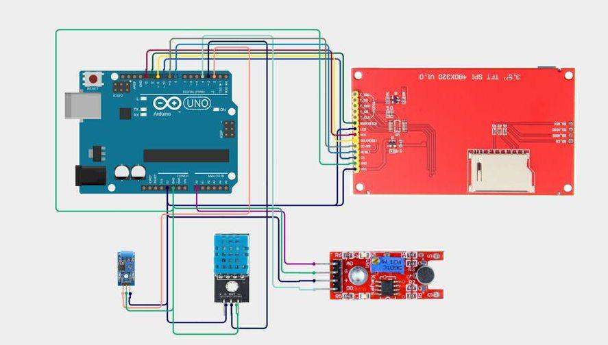
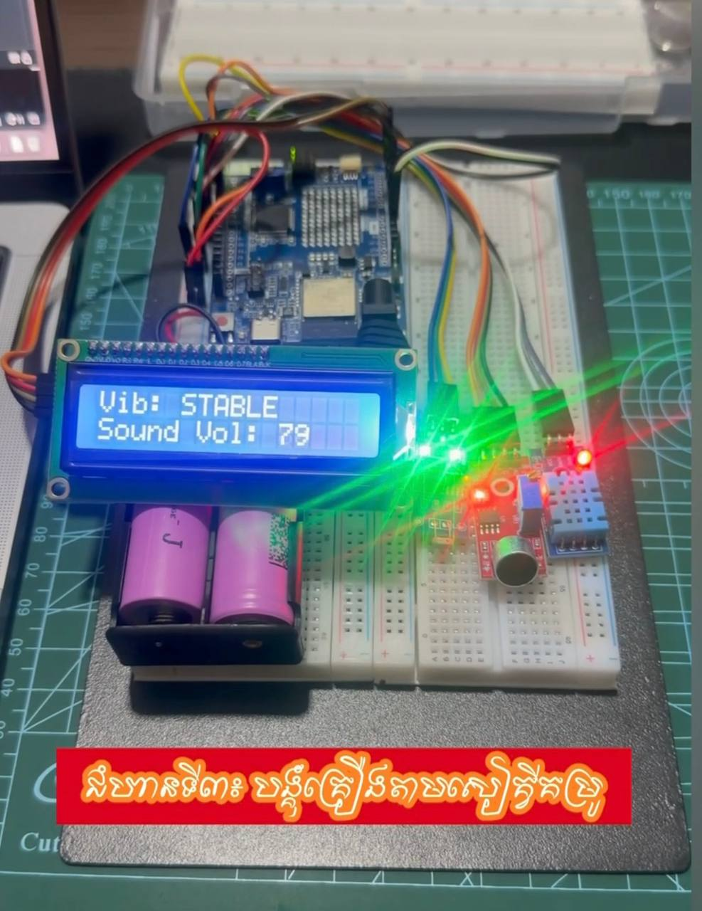

# Lesson 01: The basic sensors -> vibration, acoustic, and temperature

This is the basic lesson that build the sensor detection including vibration, accostic, and temporature by using:
- Arduino-UNO-R4-WiFi
- LCD 16x2 Screen
- DHT11 Sensor (temporature)
- Sound Sensor
- Vibration Sensor

## Circuit Diagram

## Microcontroller Codes

## Output

